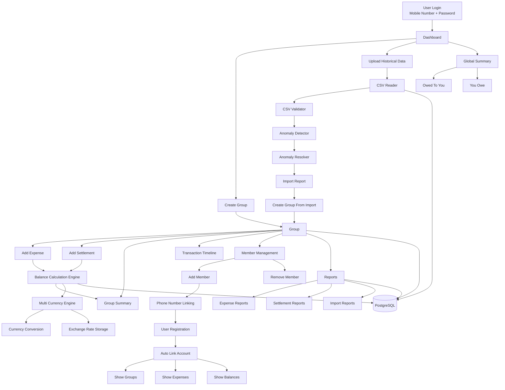
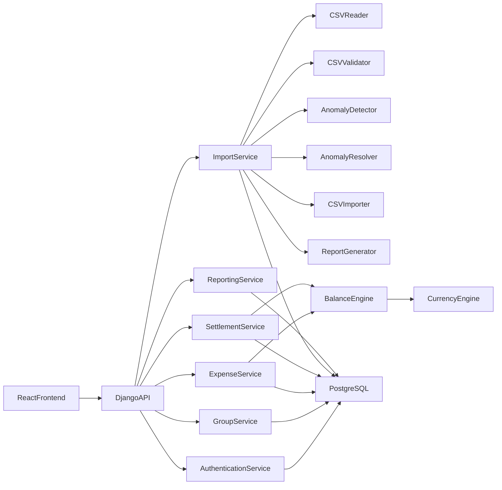

# FairSplit System Architecture

## Overview

FairSplit is a group expense management platform similar to Splitwise.

The system allows users to:

- Register using mobile number and password
- Create and manage groups
- Add and remove members
- Record expenses
- Record settlements
- Import historical expense data from CSV files
- Detect and resolve import anomalies
- Track balances across multiple currencies
- Automatically link imported members to registered user accounts

---

# System Architecture Diagram

---

# Backend Component Diagram

---

# User Journey

## New User Registration

User registers with:

- Mobile Number
- Password
- Name

After login, the user enters the dashboard.

---

## Initial Dashboard State

For a new user with no groups:

### Summary Section

Own To You: 0

You Owe: 0

### People Shared Expenses With

Empty

### Groups

Empty

### Available Actions

- Upload Historical Data
- Create Group

---

# Historical Data Import Workflow

User clicks:

Upload Historical Data

↓

Upload CSV File

↓

CSV Reader

↓

CSV Validator

↓

Anomaly Detector

↓

Anomaly Resolver

↓

User Reviews and Resolves Anomalies

↓

System asks:

- Group Name
- Number of Members
- Member Names
- Member Phone Numbers

↓

Group Created

↓

Historical Data Imported

↓

Group Appears On Dashboard

---

# Dashboard Module

## Responsibilities

Displays:

### Global Summary

- Total Amount Owed To User
- Total Amount User Owes

### Shared Members

Displays all people who share expenses with the user.

### Groups

Displays:

- Group Name
- Group Balance
- Number of Members

---

# Authentication Module

## Responsibilities

- Registration
- Login
- Logout
- Password Reset
- JWT Authentication

## Login Method

- Mobile Number
- Password

---

# Group Management Module

## Responsibilities

- Create Group
- Edit Group
- Delete Group
- View Group
- Add Member
- Remove Member
- Leave Group

---

# Member Management Module

## Responsibilities

- Add Member
- Remove Member
- Track Join Date
- Track Leave Date
- Link Members To Registered Users

---

# Group Timeline Module

Inside a group, transactions are displayed in chronological order similar to a chat.

Example:

01 Apr 2025

Dinner

Paid by Priya

₹1200

---

02 Apr 2025

Movie Tickets

Paid by Rahul

₹800

---

03 Apr 2025

Settlement

Rahul paid Priya

₹500

---

# Expense Management Module

## Responsibilities

- Add Expense
- Edit Expense
- Delete Expense
- View Expense History

## Expense Fields

- Date
- Description
- Amount
- Currency
- Paid By
- Participants
- Split Type
- Split Details

Default Date:

Current Date

User can modify the date before saving.

---

# Supported Split Types

## Equal Split

Expense divided equally among participants.

## Percentage Split

Expense divided using percentages.

Example:

- Priya: 40%
- Rahul: 60%

## Custom Split

Users manually enter amounts.

Example:

- Priya: ₹500
- Rahul: ₹700

## Share Based Split

Expense divided based on shares.

Example:

- Priya: 2 Shares
- Rahul: 1 Share

---

# Settlement Module

## Responsibilities

- Record Settlement
- Edit Settlement
- Delete Settlement
- Settlement History

Settlement records automatically update balances.

---

# Group Summary Module

Each group contains a Summary section.

Displays:

## Monthly Expense Chart

Shows total spending per month.

## Balance Summary

Displays:

- Total Owed To You
- Total You Owe

## Member Balances

Example:

- Rahul owes you ₹500
- Priya owes you ₹300
- You owe Anjali ₹200

---

# Multi Currency Support

## Supported Currencies

- INR
- USD
- EUR
- GBP
- AED

## Expense Storage

Each expense stores:

- Original Amount
- Original Currency
- Exchange Rate Used

## Group Currency

Each group has:

- Base Currency

All balances are calculated using the group base currency.

## User Preferred Currency

Users can view balances in:

- Group Currency
- Preferred Currency

---

# CSV Import Module

## Responsibilities

- Upload CSV
- Parse CSV
- Validate CSV
- Detect Anomalies
- Resolve Anomalies
- Generate Reports
- Import Historical Expenses

## CSV Components

### csv_reader.py

Reads CSV files.

### csv_validator.py

Validates CSV structure.

### anomaly_detector.py

Detects anomalies.

### anomaly_resolver.py

Generates user actions.

### csv_importer.py

Coordinates import process.

### report_generator.py

Generates import statistics.

### import_report_formatter.py

Formats reports for frontend display.

---

# Supported Import Anomalies

- Duplicate Expense
- Conflicting Expense
- Similar Name
- Missing Payer
- Missing Currency
- Refund Detection
- Settlement Detection
- Negative Amount
- Ambiguous Date
- Invalid Date Format
- Member Left Group
- Member Join Violation
- Unknown Guest
- Invalid Percentage Split
- Split Type Conflict

---

# Cross User Synchronization

Each imported member can contain:

- Name
- Phone Number

When a user later registers using the same phone number:

System automatically:

- Links the member to the user account
- Shows all related groups
- Shows all related expenses
- Shows balances
- Shows settlements

No duplicate member profile is created.

---

# Reporting Module

## Responsibilities

- Group Reports
- Expense Reports
- Settlement Reports
- Import Reports
- Monthly Spending Reports

---

# Activity Log Module

## Responsibilities

Track:

- Group Creation
- Member Changes
- Expense Changes
- Settlement Changes
- Import Activities

---

# Backend Architecture

React Frontend

↓

Django REST API

↓

Business Services

- Authentication Service
- Group Service
- Member Service
- Expense Service
- Settlement Service
- Import Service
- Reporting Service

↓

Database Layer

↓

PostgreSQL

---

# Database Entities

- User (django.contrib.auth.models.User)
- Group
- Member
- Expense
- ExpenseParticipant
- Settlement
- ImportSession
- ImportAnomaly
- AnomalyDecision

---

# System Goal

Provide a reliable, scalable, and user-friendly expense sharing platform that supports:

- Real-time balance tracking
- Historical CSV imports
- Multi-currency accounting
- Automatic account linking through mobile numbers
- Settlement optimization
- Complete expense transparency