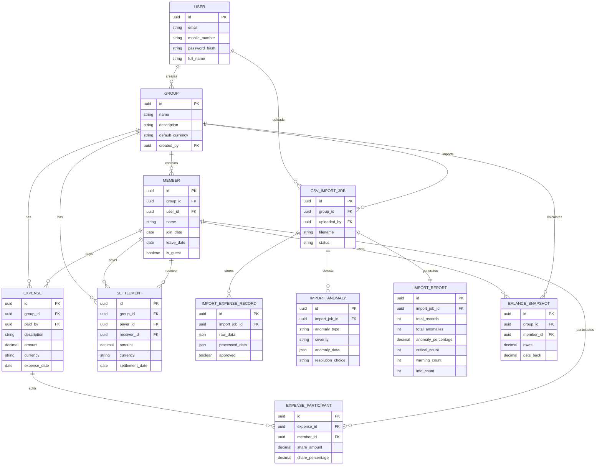

# FairSplit Database Design
## Database Overview
FairSplit is a group expense management platform that supports:
* User Authentication
* Group Management
* Expense Tracking
* Settlement Management
* CSV Import
* Anomaly Detection
* Import Reports
* AI-Assisted Analysis (Future)
---
# Entity Relationship Diagram (ERD)

# Entity Relationship Overview
User
│
├── Groups
│
├── Expenses
│
├── Settlements
│
└── CSV Import Jobs
---
# User
Stores registered users.
| Field         | Type     | Constraints |
| ------------- | -------- | ----------- |
| id            | UUID     | PK          |
| email         | String   | Unique      |
| mobile_number | String   | Unique      |
| password_hash | String   | Required    |
| full_name     | String   | Required    |
| profile_image | String   | Nullable    |
| created_at    | DateTime | Auto        |
| updated_at    | DateTime | Auto        |
---
# Group
Expense sharing groups.
| Field            | Type     | Constraints |
| ---------------- | -------- | ----------- |
| id               | UUID     | PK          |
| name             | String   | Required    |
| description      | Text     | Nullable    |
| default_currency | String   | Required    |
| created_by       | FK(User) | Required    |
| created_at       | DateTime | Auto        |
---
# Member
Members inside groups.
| Field      | Type      | Constraints   |
| ---------- | --------- | ------------- |
| id         | UUID      | PK            |
| group_id   | FK(Group) | Required      |
| user_id    | FK(User)  | Nullable      |
| name       | String    | Required      |
| email      | String    | Nullable      |
| phone      | String    | Nullable      |
| join_date  | Date      | Required      |
| leave_date | Date      | Nullable      |
| is_guest   | Boolean   | Default False |
| status     | String    | Active / Left |
---
# Expense
Main expense table.
| Field       | Type          | Constraints |
| ----------- | ------------- | ----------- |
| id          | UUID          | PK          |
| group_id    | FK(Group)     | Required    |
| description | String        | Required    |
| amount      | Decimal(12,2) | Required    |
| currency    | String        | Required    |
| paid_by     | FK(Member)    | Required    |
| date        | Date          | Required    |
| category    | String        | Nullable    |
| notes       | Text          | Nullable    |
| created_at  | DateTime      | Auto        |
---
# ExpenseParticipant
Stores who shares an expense.
| Field            | Type          | Constraints |
| ---------------- | ------------- | ----------- |
| id               | UUID          | PK          |
| expense_id       | FK(Expense)   | Required    |
| member_id        | FK(Member)    | Required    |
| share_amount     | Decimal(12,2) | Required    |
| share_percentage | Decimal(5,2)  | Nullable    |
---
# Settlement
Money transfers between members.
| Field           | Type          | Constraints |
| --------------- | ------------- | ----------- |
| id              | UUID          | PK          |
| group_id        | FK(Group)     | Required    |
| payer           | FK(Member)    | Required    |
| receiver        | FK(Member)    | Required    |
| amount          | Decimal(12,2) | Required    |
| currency        | String        | Required    |
| settlement_date | Date          | Required    |
| notes           | Text          | Nullable    |
---
# BalanceSnapshot
Stores calculated balances.
| Field         | Type          | Constraints |
| ------------- | ------------- | ----------- |
| id            | UUID          | PK          |
| group_id      | FK(Group)     | Required    |
| member_id     | FK(Member)    | Required    |
| owes          | Decimal(12,2) | Default 0   |
| gets_back     | Decimal(12,2) | Default 0   |
| calculated_at | DateTime      | Auto        |
---
# CSVImportJob
Tracks uploaded CSV files.
| Field       | Type      | Constraints                     |
| ----------- | --------- | ------------------------------- |
| id          | UUID      | PK                              |
| group_id    | FK(Group) | Required                        |
| uploaded_by | FK(User)  | Required                        |
| filename    | String    | Required                        |
| status      | String    | Processing / Completed / Failed |
| uploaded_at | DateTime  | Auto                            |
---
# ImportExpenseRecord
Stores temporary imported rows before approval.
| Field          | Type             | Constraints   |
| -------------- | ---------------- | ------------- |
| id             | UUID             | PK            |
| import_job_id  | FK(CSVImportJob) | Required      |
| raw_data       | JSON             | Required      |
| processed_data | JSON             | Nullable      |
| approved       | Boolean          | Default False |
---
# ImportAnomaly
Stores detected anomalies.
| Field             | Type             | Constraints               |
| ----------------- | ---------------- | ------------------------- |
| id                | UUID             | PK                        |
| import_job_id     | FK(CSVImportJob) | Required                  |
| anomaly_type      | String           | Required                  |
| severity          | String           | Critical / Warning / Info |
| anomaly_data      | JSON             | Required                  |
| resolution_choice | String           | Nullable                  |
| resolved          | Boolean          | Default False             |
---
# ImportReport
Stores generated reports.
| Field              | Type             | Constraints |
| ------------------ | ---------------- | ----------- |
| id                 | UUID             | PK          |
| import_job_id      | FK(CSVImportJob) | Required    |
| total_records      | Integer          | Required    |
| total_anomalies    | Integer          | Required    |
| anomaly_percentage | Decimal(5,2)     | Required    |
| critical_count     | Integer          | Required    |
| warning_count      | Integer          | Required    |
| info_count         | Integer          | Required    |
| report_json        | JSON             | Required    |
---
# Future AIAnalysis
Reserved for AI insights.
| Field         | Type      | Constraints |
| ------------- | --------- | ----------- |
| id            | UUID      | PK          |
| group_id      | FK(Group) | Required    |
| analysis_type | String    | Required    |
| result_json   | JSON      | Required    |
| created_at    | DateTime  | Auto        |
---
# Relationships
User
→ Groups
Group
→ Members
Group
→ Expenses
Group
→ Settlements
Expense
→ ExpenseParticipants
CSVImportJob
→ ImportExpenseRecord
CSVImportJob
→ ImportAnomaly
CSVImportJob
→ ImportReport
---
# Database Choice
Development:
* SQLite
Production:
* PostgreSQL
Reason:
* JSON support
* Better indexing
* Better scalability
* Transaction safety
