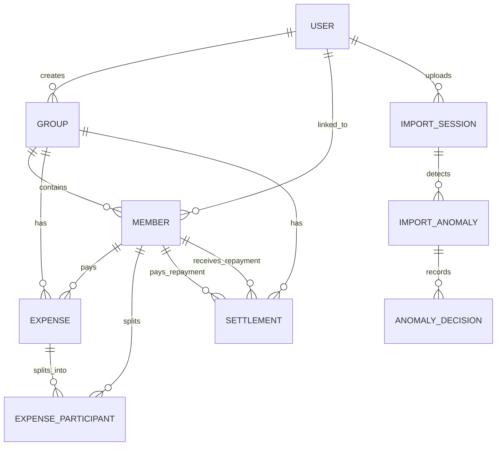

# FairSplit Database Design

## Database Overview
FairSplit is a group expense management platform built using Django. The backend uses Django's ORM and connects to an underlying database (SQLite for development, PostgreSQL for production).

The database structure supports:
* User Authentication (built-in Django `User` model)
* Group Management
* Expense Tracking & Multi-currency conversion
* Settlement Management
* CSV Import Session tracking
* Import Anomalies & User Decisions tracking

---

# Entity Relationship Diagram (ERD)

---

# Entity Schema Breakdown

## 1. User (`auth_user`)
Standard Django built-in user model.
* **Fields**:
  - `id` (int, PK): Auto-incremented primary key.
  - `username` (string): Used for phone number / mobile identifier.
  - `email` (string): User email address.
  - `password` (string): Password hash.
  - `first_name` (string): User first name.
  - `last_name` (string): User last name.
  - `is_active` (boolean): Whether the user is active.
  - `date_joined` (datetime): Time of registration.

---

## 2. Group (`core_group`)
Represents an expense sharing group.
* **Fields**:
  - `id` (int, PK): Auto-incremented primary key.
  - `name` (string): Group name.
  - `description` (text, nullable): Optional group description.
  - `default_currency` (string): Default group currency (default `"INR"`).
  - `created_by` (FK to User, nullable): User who created the group.
  - `created_at` (datetime): Time when the group was created.

---

## 3. Member (`core_member`)
Members participating in a group (can be registered users or guests).
* **Fields**:
  - `id` (int, PK): Auto-incremented primary key.
  - `group` (FK to Group): The group the member belongs to.
  - `user` (FK to User, nullable): Linked registered user account.
  - `name` (string): Name of the member in this group.
  - `email` (email, nullable): Optional email address.
  - `phone` (string, nullable): Optional phone number used to auto-link users.
  - `join_date` (date, nullable): Optional date when they joined.
  - `leave_date` (date, nullable): Optional date when they left.
  - `is_guest` (boolean): True if they are a guest (no linked user account).

---

## 4. Expense (`core_expense`)
A shared group expense.
* **Fields**:
  - `id` (int, PK): Auto-incremented primary key.
  - `group` (FK to Group): Group this expense belongs to.
  - `paid_by` (FK to Member): Member who paid for the expense.
  - `description` (string): Description of the expense.
  - `amount` (decimal): Paid amount.
  - `currency` (string): Currency of the paid amount (default `"INR"`).
  - `expense_date` (date): Date of the expense.
  - `split_type` (string): How the expense is divided (`"equal"`, `"percentage"`, `"exact"`).
  - `original_amount` (decimal, nullable): Paid amount in the original currency (before conversion).
  - `original_currency` (string, nullable): Original currency of foreign transaction.
  - `base_currency` (string, nullable): Group's base currency converted to.
  - `exchange_rate` (decimal, nullable): Currency exchange rate applied.
  - `converted_amount` (decimal, nullable): Amount after currency conversion.
  - `created_at` (datetime): Time the expense record was inserted.

---

## 5. ExpenseParticipant (`core_expenseparticipant`)
Maps members to expenses with split shares.
* **Fields**:
  - `id` (int, PK): Auto-incremented primary key.
  - `expense` (FK to Expense): Shared expense.
  - `member` (FK to Member): Participant member.
  - `share_amount` (decimal, nullable): Individual calculated share amount.
  - `percentage` (decimal, nullable): Split percentage for the participant.

---

## 6. Settlement (`core_settlement`)
Money transfer records between members to pay back debts.
* **Fields**:
  - `id` (int, PK): Auto-incremented primary key.
  - `group` (FK to Group): Associated group.
  - `payer` (FK to Member): Member transferring money.
  - `receiver` (FK to Member): Member receiving money.
  - `amount` (decimal): Settlement amount.
  - `currency` (string): Settlement currency (default `"INR"`).
  - `settlement_date` (date): Date of the transfer.
  - `notes` (text, nullable): Optional transfer comments.
  - `created_at` (datetime): Log insertion timestamp.

---

## 7. ImportSession (`core_importsession`)
Tracks a CSV file upload/import batch.
* **Fields**:
  - `id` (int, PK): Auto-incremented primary key.
  - `imported_by` (FK to User): The user who uploaded the CSV.
  - `file_name` (string): Name of the imported file.
  - `total_rows` (int): Total rows parsed from the CSV.
  - `anomaly_count` (int): Number of anomalies found in this session.
  - `imported_rows` (int): Number of successfully imported expense rows.
  - `status` (string): Import status (`"PENDING"`, `"PROCESSING"`, `"WAITING_FOR_REVIEW"`, `"COMPLETED"`, `"FAILED"`).
  - `created_at` (datetime): Import session start time.

---

## 8. ImportAnomaly (`core_importanomaly`)
Anomalies flagged during a CSV import session.
* **Fields**:
  - `id` (int, PK): Auto-incremented primary key.
  - `import_session` (FK to ImportSession): Linked import session.
  - `anomaly_type` (string): Code for anomaly type (e.g. `"ANOMALY_MISSING_PAYER"`).
  - `severity` (string): Anomaly severity level (e.g. `"CRITICAL"`, `"MEDIUM"`, `"LOW"`).
  - `anomaly_data` (json): Contextual JSON details of the anomaly.
  - `resolved` (boolean): Flag indicating if the anomaly has been resolved.
  - `created_at` (datetime): Flagged timestamp.

---

## 9. AnomalyDecision (`core_anomalydecision`)
Records choices made by the user to resolve import anomalies.
* **Fields**:
  - `id` (int, PK): Auto-incremented primary key.
  - `import_anomaly` (FK to ImportAnomaly): The resolved anomaly.
  - `selected_option` (string): Option selected by the user (e.g. `"Accept Conversion"`).
  - `original_value` (json, nullable): Original raw value prior to resolution.
  - `final_value` (json, nullable): Final corrected/adjusted value.
  - `created_at` (datetime): Time of resolution choice.

---

# Database Choice
* **Development**: SQLite (packaged, file-based, zero setup required).
* **Production**: PostgreSQL.
  - **Reason**: Excellent support for JSON data querying (`anomaly_data`, `original_value`, `final_value`), strict constraints, relational integrity, and transaction safety.
